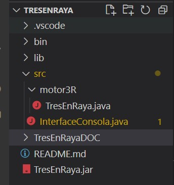
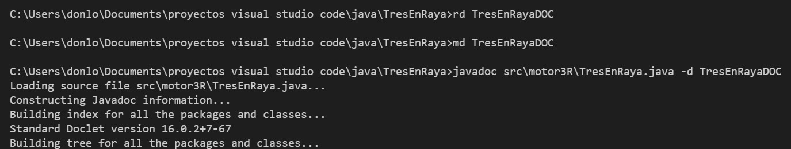
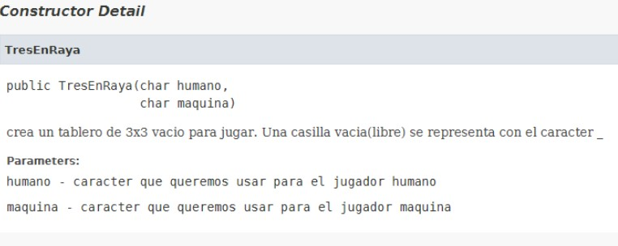

# TRES EN RAYA
Se pide hacer  un tres en raya. 
No es importante que tenga mil opciones y que el diálogo con el usuario sea rebuscado. Los objetivos de esta práctica son:
- que la lógica del juego descanse en una clase independiente de la entrada salida.
- utilizar el principio de ocultación
- generar javadoc para la clase de la lógica del juego 

Descripción de cosas que debe  cumplirse el proyecto:
1. Nos limitamos a Jugador humano vs máquina. Para no liar el código con muchas opciones descartamos la opción humano vs humano. El juego de la máquina es el más interesante para nosotros ya que es el programador el que juega y decide en nombre de la máquina. La máquina puede jugar a muchos niveles de elaboración de jugadas, por ejemplo:
    * a. simple: hace sus movimientos a una de las casillas libre al azar o a la primera que ve libre por orden de recorrido matriz
    * b. intermedio: mira antes de mover donde  puede hacer raya 
    * c. difícil: añade al paso anterior la comprobación de que si no puede hacer raya mira si puede  “tapar” la posible raya de su rival 

Con la opción “a” es suficiente, luego si te gusta el juego lo haces más elaborado incorporando b y c ¡pero primero que funcione con la       opción a! Y por cierto, todavía hay soluciones más sofisticadas que la “dificil” pero con esto nos basta.
Si te decides a incorporar el nivel intermedio y/o dificil, puedes aprovechar el mecanismo de ramas de git para seguir hacia adelante: creas una rama que s llame por ejemplo"intermedio" y cuando funcione le haces un merge a la master. Similar con "dificil"

2. Trabajar en un proyecto de nombre TresEnRaya
3. Deben escribirse  al menos  dos clases:
    * clase *motor3R.TresEnRaya*: se ocupa de  la lógica  del juego controlando el estado del tablero. No se limita a almacenar una tabla si no que controla la lógica del juego:
       *  lleva el control de fin de partida y puede preguntársele si la partida acabó o no. Si la partida acabó también puede preguntársele si el ganador es el humano o la máquina o hubo empate(tablero lleno sin raya). 
        * Cuando juega la máquina es la clase tablero la que toma la decisión a dónde mover según el nivel de dificultad que se le indica al principio de la partida. 
   * clase *InterfaceConsola*: Interconecta usuario y clase *motor3R.TresEnRaya*. Como describe su nombre, se trata de un  interface de usuario de consola y por tanto contiene el main(). La clase InterfaceConsola recoge los datos del usuario y se los envía a la clase TresEnRaya, por ejemplo cuando el jugador humano realiza un movimiento la clase InterfaceConsola recoge las coordenadas y se las envía a la clase TresEnRaya. Para indicar al usuario que se terminó la partida o quién ganó  la clase Interface se lo pregunta previamente a la clase TresEnRaya ya que es ella la que tiene el control del juego. Puedes asumir que el usuario teclea los datos correctamente, por ejemplo, no teclea las coordenadas de una casilla ya ocupada. Pertenece al paquete por defecto.

Observa que si la clase TresEnRaya está bien escrita podrás reutilizarla para hacer una versión gráfica del Tres en raya. Donde reutilizar significa no tener que modificarla en absoluto y  directamente poder usarla desde  una  clase  que se ocupara del diálogo con el usuario pero de forma gráfica. POR LO TANTO:
* ¡no puede haber ni un println() en la clase TresEnRaya! Tampoco puede usar System.in ni "usar" de ningún modo a la clase InterfaceConsola. TresEnraya en su código desconoce por completo la existencia de InterfaceConsola.
* La clase interface no puede modificar directamente el tablero de juego, se limita a mandar los datos a TresEnRaya para que lo modifique oportunamente TresEnRaya. Todo lo que puede hacer la clase interfaceConsola es leer los datos del tablero para imprimirlos por pantalla

4. Los atributos de las clases deben ser privados y  la clase TresEnRaya debe cumplir el principio de ocultación. Puedes pensar que nadie va a usar tu clase y que no es importante el principio de ocultación, pero se trata de practicar, por otro lado dentro de unos meses si vuelves a usar la clase para hacer un interface gráfico y te da pereza revisar el código el principio de ocultación también protege a tu clase ¡de ti mismo!. 

5. Genera javadoc para la parte pública de TresenRaya. Cuando generes el javadoc, tendrás que escribir el texto de ayuda de forma que otro programador distinto de ti, sin mirar el código java de tu clase, sepa perfectamente como manejarla. Si las explicaciones son buenas y sencillas es porque los métodos públicos están bien diseñados, y por tanto son fáciles de entender y manejar. Piensa que si el javadoc no se entiende, sea probablemente porque la estructura de tu clase al respecto de los métodos de tu clase no es el adecuado. Cuando lo estes haciendo puedes preguntar a un compañero si sería capaz de manejar la clase con tu javadoc y sacas conclusiones. 

SE ENTREGA:  un proyecto en gitlab  con tu solución del proyecto un .jar y una carpeta con el javadoc como indica la imagen

Puedes utilizar el propio IDE para generar el .jar
Para generar el javadoc quizá mejor la consola como ilustra la siguiente imagen

El javadoc debe describir la parte pública de la clase TresEnRaya. Piensa que si un programador tiene sólo TresEnRaya.class (no el .java) y el javadoc debe poder saber utilizarla.

Por ejemplo para el constructor podría ser algo parecido a lo siguiente

lo que implica que para crear un tablero de juego haría por ejemplo
 TresEnRaya tablero= new TresEnRaya(‘X’,’O’);

En definitiva el javadoc me debe indicar como manejar la clase sin especificar detalles de implementación interna

